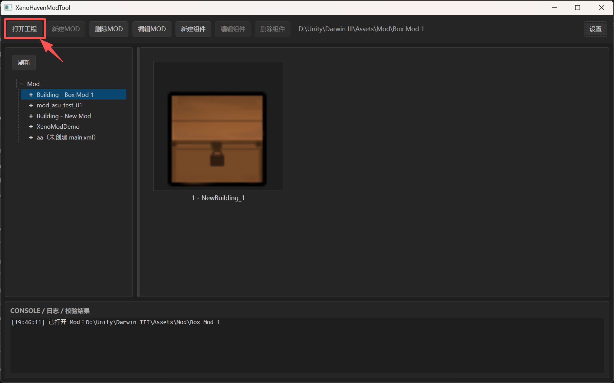
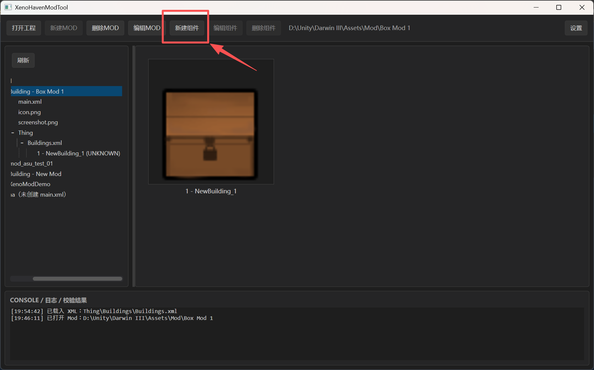
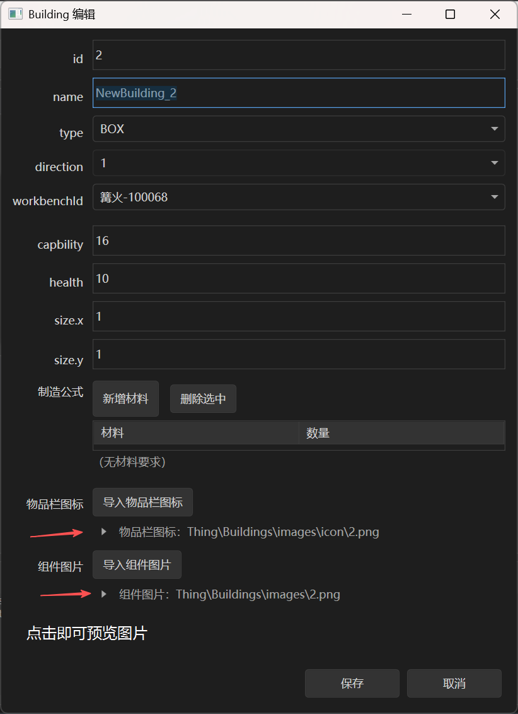

# 异星家园（XenoHaven）Mod 制作完整教程

> 面向零基础作者：从安装工具、新建 Mod、制作建筑组件，到进游戏测试、上传 Steam 创意工坊——一步步讲清楚「为什么」和「怎么做」。  
> 配套工具：**XenoHaven MOD Toolkit**（`XenoHavenModTool.exe`）  
> 当前版本能力：**建筑类 Mod**（`Thing/Buildings`）。暂不支持脚本、Prefab 编辑、游戏内实时预览。

更偏技术约定的 XML / 目录说明见 [ModDevGuide.md](./ModDevGuide.md)；偏工具按钮操作的短文见 [SteamModDevGuide.md](./SteamModDevGuide.md)。本文把整条流水线串成一篇「跟做就能发」的教程。

---

## 目录

1. [先搞懂：Mod 到底是什么](#1-先搞懂mod-到底是什么)
2. [准备工作](#2-准备工作)
3. [认识工具界面](#3-认识工具界面)
4. [第一步：创建你的第一个 Mod](#4-第一步创建你的第一个-mod)
5. [第二步：制作建筑组件](#5-第二步制作建筑组件)
6. [第三步：检查与本地测试](#6-第三步检查与本地测试)
7. [第四步：上传到 Steam 创意工坊](#7-第四步上传到-steam-创意工坊)
8. [第五步：更新已发布的 Mod](#8-第五步更新已发布的-mod)
9. [建筑类型详解（怎么选 type）](#9-建筑类型详解怎么选-type)
10. [常见问题与避坑](#10-常见问题与避坑)
11. [附录：目录与 XML 速查](#11-附录目录与-xml-速查)

---

## 1. 先搞懂：Mod 到底是什么

### 1.1 一句话说明

在《异星家园》里，一个 **Mod** 就是一个带 `main.xml` 的文件夹。游戏启动时会扫描这些文件夹，把里面定义的建筑、材料配方等内容注册进游戏。

你不需要写代码。用本工具点几下、填几项、导入几张图，工具会帮你生成游戏能读懂的 XML 和图片文件。

### 1.2 游戏怎么加载 Mod

```text
启动游戏
  → 扫描 Mod 目录里的各个文件夹
  → 读每个文件夹的 main.xml（这是谁、叫什么）
  → 读 Thing/Buildings/Buildings.xml（有哪些建筑）
  → 按图片命名规则找贴图
  → 把已启用的内容注册进游戏
```

**重要**：游戏一般不支持「热重载」。你改了 XML 或图片，通常要**重启游戏**或**重新进档**才能看到效果。

### 1.3 三个容易混淆的 ID

做 Mod 和上传工坊时，你会看到好几种「数字」，请先分清：

| 名称 | 在哪里 | 干什么 | 能不能手改 |
|------|--------|--------|------------|
| **Mod 基础 ID** | `main.xml` 的 `<id>` | 游戏里内容编号的基础值；最终物品 ID ≈ 基础 ID + 组件本地序号 | 创建后**不可改** |
| **组件本地序号** | `Buildings.xml` 里每条建筑的 `<id>` | 本 Mod 内的 1、2、3…；同时决定图片文件名 | 新建时自动分配，一般不要乱改 |
| **创意工坊 PublishedFileId** | `main.xml` 的 `<steamPublishedFileId>` | Steam 工坊条目的主键；用来「更新」而不是「再新建一条」 | 新建为 `0`；**首次上传成功后由工具自动写入** |

记住口诀：

- **Mod ID** = 给游戏认内容用的  
- **PublishedFileId** = 给 Steam 工坊认作品用的  
- 两者**互不替代**，更新工坊条目靠的是后者，不是前者

### 1.4 当前能做什么、不能做什么

| 能做 | 暂不能做 |
|------|----------|
| 新建 / 编辑建筑类 Mod | 写脚本、改逻辑 |
| 箱子、装饰物、灯、路灯、生产线外观替换类组件 | 编辑 Unity Prefab |
| 配材料、工作台、占地、碰撞 | 游戏内实时预览 / 热重载 |
| 校验 XML、上传 / 更新 Steam 创意工坊 | 上传到非 Steam 的自定义服务器 |

---

## 2. 准备工作

### 2.1 你需要准备什么

1. **Windows 电脑**（本工具为 WPF 桌面程序）
2. **Steam 客户端已安装并登录**（本地编辑不强制；**上传工坊必须**）
3. **XenoHaven MOD Toolkit**（Steam 库里启动，或运行发布包里的 `XenoHavenModTool.exe`）
4. **两张 Mod 用图**（新建时就要）：
   - `icon.png`：列表小图标（建议正方形、清晰）
   - `screenshot.png`：详情 / 工坊预览大图（建议能看清你的建筑长什么样）
5. **每个建筑两张图**（做组件时再准备）：
   - **组件图片**：放在地图上显示的外观
   - **物品栏图标**：背包 / 物品栏里的小图标

图片格式支持：`png` / `jpg` / `jpeg` / `bmp` / `webp`。工坊预览图最终建议用 png/jpg，且**不要超过 1MB**（Steam 限制）。

### 2.2 如何启动工具

任选一种方式：

- **Steam**：在库中找到工具或游戏附带的 Mod 工具，点击开始  
- **便携版**：打开发布目录，双击 `XenoHavenModTool.exe`  
- **源码开发**：在仓库里执行  
  ```powershell
  dotnet run --project .\app\app.csproj
  ```

启动后窗口标题为 **XenoHavenModTool**。

### 2.3 Mods 文件夹在哪（不用你手动配置）

工具会自动使用程序旁边的 **`Mods`** 文件夹：

- 开发时：仓库根目录下的 `Mods/`
- 发布版：exe 同级目录下的 `Mods/`

规则很简单：

- `Mods` 下**每一个一级子文件夹 = 一个 Mod 工程**
- 没有 `Mods` 时，启动会自动创建
- 你**不需要**先选「工作目录」

仓库里自带示例 `Mods/XenoModDemo`，第一次打开左侧树里通常能看到它，可以拆开对照学习。

### 2.4 Steam 连接状态

主窗口顶栏会显示 Steam 是否已连接。

- 已连接：可看到你的 Steam 昵称等信息，**「上传工坊」**可用  
- 未连接：仍可新建、编辑、保存本地 Mod；上传会提示你先登录 Steam，再点 **「重连 Steam」**

建议一开始就开着 Steam，少踩「做到最后发现传不上去」的坑。

---

## 3. 认识工具界面

主界面可以分成四块：

```text
┌─────────────────────────────────────────────────────────┐
│ 顶栏：打开工程 / 新建MOD / 编辑MOD / 上传工坊 / 组件操作… │
├──────────────┬──────────────────────────────────────────┤
│              │                                          │
│  左侧 Mod 树  │         右侧：组件磁贴预览区              │
│  （工程列表）  │         （像卡片一样列出每个建筑）         │
│              │                                          │
├──────────────┴──────────────────────────────────────────┤
│ 底部：CONSOLE / 日志 / 校验结果（出问题先看这里）          │
└─────────────────────────────────────────────────────────┘
```



*图 1：顶栏工具按钮、左侧树、右侧预览与底部日志。*

### 3.1 左侧树在干什么

- 顶层 **Mod**：总览；点它或空白处可回到「未打开具体工程」的状态  
- 每个 Mod 文件夹名：点一下 = 打开该工程  
- 展开后可见：`main.xml`、`icon.png`、`screenshot.png`、`Thing/Buildings/...`、各个组件节点  

顶栏按钮会像资源管理器一样**随选中项变灰或可用**。例如：

- 选中 Mod 根或 `Buildings.xml` → **新建组件** 可用  
- 选中某个组件 → **编辑组件 / 删除组件** 可用  

### 3.2 右侧磁贴

每个建筑一条卡片，通常显示物品栏图标和名称。单击选中，双击打开编辑。

### 3.3 底部日志

保存、校验、上传时的成功 / 警告 / 错误都会写在这里。  
**养成习惯：每次保存后扫一眼底部有没有 `[错误]`。**

---

## 4. 第一步：创建你的第一个 Mod

### 4.1 点击「新建MOD」

确保当前处于总览、或未打开其它工程时，顶栏 **「新建MOD」** 可用，点开。

### 4.2 填写信息（字段解释）

| 字段 | 你要填什么 | 备注 |
|------|------------|------|
| **id** | 不用填 | 自动生成；创建后只读。游戏用它当内容基础 ID |
| **steamPublishedFileId** | 不用填 | 新建固定 `0`；上传成功后会变成工坊条目 ID |
| **SupportVersion** | 不用填 | 固定 `1` |
| **name** | Mod 显示名 | 必填，会出现在游戏列表和工坊标题里 |
| **auth** | 作者名 | 必填 |
| **version** | 版本号 | 默认 `1.0.0`，以后大改可改成 `1.1.0` 等 |
| **Category** | 分类 | 默认 `Building`，用于工具总览分组 |
| **description** | 介绍文字 | **必填**；工坊简介也会用它 |
| **icon.png** | 列表图标 | **必填**，可点选或拖拽导入 |
| **screenshot.png** | 详情 / 预览图 | **必填**；上传工坊时优先当预览图 |

填完点 **create**。

若提示某项不能为空、或没导入图片，按提示补齐即可。

### 4.3 创建成功后磁盘上长什么样

工具会在 `Mods/` 下建一个文件夹（名字多半来自你的 `name`；重名会自动加 `_2`、`_3`…），结构如下：

```text
你的Mod名称/
  main.xml                 ← Mod 身份证
  icon.png                 ← 列表图标
  screenshot.png           ← 详情截图
  Thing/
    Buildings/
      Buildings.xml        ← 组件列表（刚开始是空的）
      images/
        icon/              ← 以后放物品栏图标
```

此时左侧树会自动选中新 Mod，你可以继续做组件。

### 4.4 以后想改名字 / 简介怎么办

选中该 Mod（或 `main.xml` 等），点 **「编辑MOD」**：

- 可改：name、auth、version、Category、description、两张根目录图  
- 不可改：id、steamPublishedFileId、SupportVersion  

点 **save** 写入磁盘。若缺 description / 缺图，校验会拦住保存。

---

## 5. 第二步：制作建筑组件

工具里说的 **「组件」** = `Buildings.xml` 里的一条建筑定义（箱子、装饰物、灯、生产线等）。

### 5.1 新建组件

1. 打开你的 Mod  
2. 在左侧树选中 **Mod 根** 或 **`Buildings.xml`**  
3. 点顶栏 **「新建组件」**



*图 3：选中 Mod 或 Buildings.xml 后，「新建组件」可用。*

会弹出 **Building 编辑** 窗口。

### 5.2 建议的填写顺序（跟做）

按这个顺序填，最不容易漏：

1. **name**：玩家看到的建筑名，例如「我的储物箱」  
2. **type**：建筑类型（见第 9 章；新手可先选 `BOX`）  
3. **workbenchId**：在哪张工作台能造它（下拉选「名称-ID」，XML 里只存数字）  
4. **size.x / size.y**：占地格子数，正整数，例如 `1` × `1`  
5. **capbility**（若显示）：容量，**16～96**；只有箱子类等需要  
6. **simulateId**（仅生产线）：选要「模拟」的原版生产线  
7. **制造公式**：点添加材料 → 从材料表选 → 填数量（每条 **1～200**）  
8. **碰撞**：开 = 挡路（`barrier=true`）；关 = 可穿过  
9. **导入两张图**：组件图片 + 物品栏图标  
10. 点 **保存**

保存后工具会立刻：

- 写入 `Thing/Buildings/Buildings.xml`  
- 按组件 id 保存图片到 `images/` 与 `images/icon/`  
- 刷新左侧树和右侧磁贴  

### 5.3 字段对照表（编辑窗 ↔ 含义）

| 界面字段 | 含义 | 新手注意 |
|----------|------|----------|
| **id** | 本地序号 1、2、3… | 只读；**不要**自己改成「Mod基础ID+序号」；图片也按这个序号命名 |
| **name** | 显示名 | 必填 |
| **type** | 建筑类型 | 决定有哪些字段、朝向是否可改、默认是否碰撞 |
| **direction** | 朝向 | 多数类型固定为 `1`；生产线可选 `1` 或 `3` |
| **workbenchId** | 建造用工作台 | 必须从下拉表选，别瞎填数字 |
| **simulateId** | 模拟哪条原版生产线 | 仅 `PRODUCTION_LINE` 必填 |
| **capbility** | 容量 | 拼写就是 `capbility`（少一个 a）；**不要**改成 `capability`，游戏可能读不出来 |
| **health** | 耐久相关 | 工具固定写 `10`，界面一般不用你改 |
| **size** | 占地 | x、y 都要是正整数 |
| **制造公式** | 建造消耗 | 材料从表选；数量 1～200 |
| **碰撞** | 是否实体阻挡 | `BOX` 默认开；装饰物 / 灯默认关 |
| **物品栏图标** | 背包里的小图 | 存为 `images/icon/<id>.png` |
| **组件图片** | 地图上的外观 | 存为 `images/<id>.png` |

图片可以点按钮导入，也可以**拖拽**到预览区。

### 5.4 编辑、删除组件

| 操作 | 做法 |
|------|------|
| **编辑** | 树或磁贴选中 → **编辑组件**；或**双击** |
| **删除** | 选中 → **删除组件** → 确认。会从 XML 删掉，并尝试删除对应图片 |



*图 4：选中组件后编辑，或双击打开。*

### 5.5 做完一个「最小可用」组件长什么样

假设你的第一个组件 id 为 `1`，磁盘上应类似：

```text
你的Mod名称/
  main.xml
  icon.png
  screenshot.png
  Thing/Buildings/
    Buildings.xml          ← 里面有一条 id=1 的定义
    images/
      1.png                ← 地图外观
      icon/
        1.png              ← 物品栏图标
```

图片**不会**写进 XML 字段，全靠「文件名 = 组件 id」这条约定。少一张图，游戏里就可能显示异常。

---

## 6. 第三步：检查与本地测试

### 6.1 先看工具有没有报错

底部日志里关注：

- `[错误]`：必须修（缺 description、缺 icon、id 重复、材料数量非法等）  
- `[警告]`：建议修（例如生产线 ID 在表里找不到）

上传工坊前，工具会再跑一遍 **Mod 元信息校验**（description、icon、screenshot 等）；有错误会直接拦住上传。

### 6.2 把 Mod 放进游戏能读到的位置

具体路径以游戏当前版本说明为准。一般是：

- 游戏指定的 Mods / Workshop 内容目录，或  
- 订阅工坊后由 Steam 自动下载的位置  

开发阶段常见做法：把 `Mods/你的Mod名称` **整夹复制**到游戏的 Mod 目录（不要只拷某一个 xml）。

若你是从 Unity 工程里拷出来的文件，目录里可能夹着大量 `*.meta`。这些对游戏运行**没用**，发布 / 上传前应去掉。本工具上传界面默认勾选 **「上传时排除 .meta 文件」**，会在临时目录里清掉再传。

### 6.3 进游戏怎么测

建议自测清单：

1. 游戏 Mod 列表里能看到你的 Mod（名称、图标、描述）  
2. 启用后进档（或重启后再进）  
3. 找到对应工作台，配方列表里能看到你的建筑  
4. 材料数量对不对、能不能造出来  
5. 放在地上：外观、占地、能不能挡住角色（碰撞）  
6. 若是箱子：容量是否符合预期  
7. 若是灯 / 路灯：发光、缺电提示是否正常  
8. 若是生产线：是否按你选的 `simulateId` 那条原版线在运转  
9. 拆除后进背包：物品栏图标是否正确  

**记住**：改完文件再测，先**重启游戏或重新进档**。工具校验通过 ≠ 游戏一定完美，实测永远是最后一关。

---

## 7. 第四步：上传到 Steam 创意工坊

发布通道只有一条：**Steam 创意工坊**（游戏 App ID：`3461270`）。不需要 SteamCMD，也不用自己填账号密码——用本机已登录的 Steam 会话即可。

工坊介绍页：https://steamcommunity.com/workshop/about/?appid=3461270

### 7.1 上传前检查清单

- [ ] Steam 客户端已登录，工具顶栏显示已连接  
- [ ] `main.xml` 里 name、description 齐全  
- [ ] 根目录有 `icon.png` 和 `screenshot.png`  
- [ ] 至少一个组件已保存，游戏内自测过（强烈建议）  
- [ ] `screenshot.png` 尽量 **≤ 1MB**（过大时工具会提示压缩）  
- [ ] 若 `steamPublishedFileId` 仍为 `0`，这是**首次发布**；若已有数字，则是**更新**（见第 8 章）

### 7.2 打开上传窗口

1. 打开要发布的那个 Mod  
2. 点顶栏 **「上传工坊」**  
3. 若提示未连接 Steam → 先登录 Steam → **重连 Steam** → 再试  

### 7.3 上传窗口里填什么

| 项 | 说明 |
|----|------|
| **标题** | 默认用 `main.xml` 的 name，可微调 |
| **简介** | 默认用 description，可微调 |
| **可见性** | 公开 / 仅好友 / 私有（建议先「私有」自测，再改公开） |
| **上传时排除 .meta** | 建议保持勾选 |
| **预览图** | 优先用 `screenshot.png`，太大或不存在时可能回退到 `icon.png` |

确认后开始上传。窗口会显示进度。

### 7.4 幕后发生了什么（帮助你理解「首次」和「更新」）

```text
steamPublishedFileId == 0 ?
  是 → 向 Steam 申请创建一个新工坊条目（CreateItem）
       → 拿到 PublishedFileId
       → 提交标题、简介、可见性、预览图、整个 Mod 文件夹内容
  否 → 用已有 PublishedFileId 更新（StartItemUpdate）
       → 同样提交标题、简介、可见性、预览图、内容
→ 成功后，工具把 PublishedFileId 写回 main.xml 的 <steamPublishedFileId>
```

成功后你可以在浏览器打开类似：

```text
https://steamcommunity.com/sharedfiles/filedetails/?id=这里是PublishedFileId
```

### 7.5 第一次上传成功后务必做的两件事

1. **打开 `main.xml` 看一眼**：`steamPublishedFileId` 是否已从 `0` 变成一长串数字。  
   - 有数字 = 以后改内容再点上传，会**更新同一条工坊作品**  
   - 若你擅自改回 `0` 再传，可能又创建一条新作品（重复条目）  
2. **Steam 创意工坊协议**：若 Steam 要求你接受协议，条目才可能完全公开。按网页提示点同意即可。

### 7.6 可见性建议

| 阶段 | 建议 |
|------|------|
| 刚做完、自己测 | **私有** |
| 找朋友帮忙测 | **仅好友** |
| 确认无大问题 | **公开** |

标题、简介、可见性都可以在之后再次上传时一起改。

---

## 8. 第五步：更新已发布的 Mod

当你已经发布过一次（`steamPublishedFileId` ≠ 0）：

1. 用工具改组件、改图、改描述、改 version  
2. 本地再测一遍  
3. 再点 **「上传工坊」**  

工具会走「更新已有条目」，**不会**再 Create 一条新的（只要你没把 PublishedFileId 弄丢或清零）。

版本号建议随内容变更：

- 修图、改文案：`1.0.1`  
- 加新建筑、改配方：`1.1.0`  
- 大改结构：`2.0.0`  

（版本号主要给人看；工坊是否覆盖内容取决于你是否重新 Submit 了文件夹。）

---

## 9. 建筑类型详解（怎么选 type）

| type | 适合做什么 | direction | 容量 capbility | simulateId | 默认碰撞 |
|------|------------|-----------|----------------|------------|----------|
| **BOX** | 储物箱、有容量的容器 | 固定 1 | 要填，16～96 | 无 | 开 |
| **SIMPLE_OBJECT** | 纯装饰、摆件 | 固定 1 | 无 | 无 | 关 |
| **SMALL_LAMP** | 小型灯具（用电发光） | 固定 1 | 无 | 无 | 关 |
| **STREET_LIGHT** | 路灯类大范围照明 | 固定 1 | 无 | 无 | 关 |
| **PRODUCTION_LINE** | 外观自定义的生产线 | 1 或 3 | 无 | **必填**（选原版线） | 编辑时默认开 |

### 选类型的直觉

- 想让玩家**往里面塞东西** → `BOX`  
- 只想好看、不挡路 → `SIMPLE_OBJECT`  
- 要灯 → `SMALL_LAMP` 或 `STREET_LIGHT`  
- 要能生产、但换一套皮 → `PRODUCTION_LINE`，并选对 `simulateId`

生产线的 `simulateId` 来自工具旁的数据表 `DOC/S-生产线定义.xlsx`（界面显示「名称-ID」）。选错 ID，游戏里可能配方对不上或加载异常。

材料与工作台分别来自：

- `DOC/K-可用材料表.xlsx`  
- `DOC/K-可用工作台.xlsx`  

请尽量**只从下拉选**，不要手抄猜数字。

---

## 10. 常见问题与避坑

### Q1：新建不了 / 按钮是灰的？

检查是否已打开某个工程导致「新建MOD」不可用；回到总览（点顶层 Mod 或空白），或先关掉当前工程再试。组件按钮则要选对树节点（根 / Buildings.xml / 具体组件）。

### Q2：保存了但游戏里没有？

- 文件是否放到游戏实际扫描的目录  
- 是否启用了该 Mod  
- 是否重启 / 重新进档  
- 底部日志是否有错误导致内容不完整  

### Q3：图片对不上建筑？

确认文件名是本地序号：`1.png`、`2.png`，而不是「Mod基础ID+序号」。物品栏图标必须在 `images/icon/` 下。

### Q4：容量字段写了 capability 游戏读不到？

字段名必须是 **`capbility`**（游戏端按这个拼写反序列化）。用本工具编辑一般不会写错；若手改 XML，千万别「纠正拼写」。

### Q5：上传失败：未连接 Steam？

启动并登录 Steam → 工具里点 **重连 Steam** → 确认顶栏显示已连接。

### Q6：预览图上传失败？

检查 `screenshot.png` 是否存在、是否损坏、是否超过约 1MB；必要时压缩后再传。

### Q7：为什么会有两个一模一样的工坊条目？

常见原因：把 `steamPublishedFileId` 改回了 `0`，工具以为是「首次发布」又 Create 了一次。正确做法是保留写入的 ID，用更新流程。

### Q8：能不能只上传 Buildings.xml？

不能。工坊内容是**整个 Mod 文件夹**（标题/简介/预览另设）。缺图、缺 main.xml 的半成品不要传。

### Q9：health 文档里有时写 100？

以工具实际为准：当前固定写入 **10**。手改成其它值可能与工具再次保存时不一致。

### Q10：文档里的「导出发布版」按钮呢？

部分旧文档提到「导出发布版 / 清理 .meta」独立按钮；当前版本上传时通过 **排除 .meta 的临时打包**完成同等目的。日常开发直接编辑 `Mods/` 下工程，发布走「上传工坊」即可。

---

## 11. 附录：目录与 XML 速查

### 11.1 完整目录模板

```text
MyBuildingMod/
  main.xml
  icon.png
  screenshot.png
  Thing/
    Buildings/
      Buildings.xml
      images/
        1.png
        2.png
        icon/
          1.png
          2.png
```

### 11.2 main.xml 示例

```xml
<?xml version="1.0" encoding="utf-8"?>
<defs xmlns:xsd="http://www.w3.org/2001/XMLSchema" xmlns:xsi="http://www.w3.org/2001/XMLSchema-instance">
  <id>70000000</id>
  <steamPublishedFileId>0</steamPublishedFileId>
  <SupportVersion>1</SupportVersion>
  <Category>Building</Category>
  <name>Example Building Mod</name>
  <auth>XenoHaven Mod Author</auth>
  <version>1.0.0</version>
  <description>一个用于演示的基础建筑 MOD。</description>
</defs>
```

### 11.3 Buildings.xml 最小箱子示例

```xml
<?xml version="1.0" encoding="utf-8"?>
<ArrayOfModBuildingXML xmlns:xsd="http://www.w3.org/2001/XMLSchema" xmlns:xsi="http://www.w3.org/2001/XMLSchema-instance">
  <ModBuildingXML>
    <id>1</id>
    <name>Example Box</name>
    <type>BOX</type>
    <direction>1</direction>
    <capbility>16</capbility>
    <size>
      <x>1</x>
      <y>1</y>
    </size>
    <workbenchId>100083</workbenchId>
    <materials>
      <ModCraftMaterialData>
        <id>100055</id>
        <count>10</count>
      </ModCraftMaterialData>
    </materials>
    <health>10</health>
    <barrier>true</barrier>
  </ModBuildingXML>
</ArrayOfModBuildingXML>
```

仓库内还可对照：

- `samples/ExampleMod/` — 最小示例  
- `Mods/XenoModDemo/` — 多类型演示  

### 11.4 全流程一张图

```text
安装并启动工具 + 登录 Steam
        ↓
新建MOD（填信息 + icon + screenshot）
        ↓
新建组件（选 type → 工作台/材料 → 两张图 → 保存）
        ↓
看底部日志无 [错误]
        ↓
复制到游戏 Mod 目录 → 重启/进档实测
        ↓
上传工坊（建议先私有）→ 记下 steamPublishedFileId
        ↓
以后改内容 → 再上传 = 更新同一条作品
```

---

## 相关文档

- [SteamModDevGuide.md](./SteamModDevGuide.md) — 工具按钮向短教程（含截图）  
- [ModDevGuide.md](./ModDevGuide.md) — XML / 目录 / 游戏端对接技术约定  
- [steam_workshop_mod_upload_logic.md](./steam_workshop_mod_upload_logic.md) — 工坊上传实现细节（开发者向）

祝你做出好玩的异星家园建筑 Mod。有问题先看底部日志，再对照第 10 章避坑清单。
